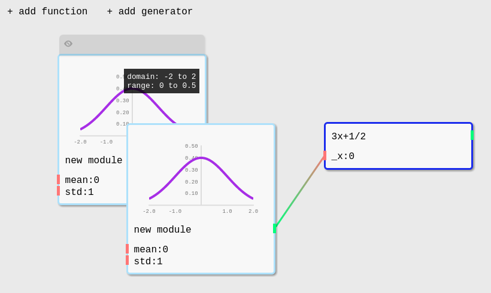

tool for designing system dynamics/agent-based models

(wip)

```
npm install -d
npm start
```

---

agent component spec

- has state variables
    - all state variables are output variables
    - design challenge: what if there are many, many state variables?
        - collapse & make searchable?
    - all state variables have inputs which are for initializing their values
- has behaviors
    - may have read or write access to state variables
        - if multple behaviors have write access to the same state variable ("behavior conflict"), show a critical tooltip
    - have required state variables and optional state variables
        - if a required state variable is missing, show a critical tooltip
    - behaviors should specify how to resolve conflicts ("update conflict")
        - perhaps offer multiple default options (mean, random, etc)
            - diff options may be available for diff conditions (e.g. mean is not available for discrete vars)
        - behavior can also offer multiple options
    - behaviors themselves may have parameters (should these be inputs too?)
- population interaction behaviors
    - special "linking behaviors" (or "mixing behaviors"?) which connect 2+ populations
- environments
    - SingleOccupancyGrid & MultiOccupancyGrid
        - toroidal/wraps or define boundary conditions
        - moore or von neumann neighborhoods
- schedules
    - synchronous (simultaneous)
    - asynchronous (random sequential)
- support tagging inputs as "high-level" parameters (accessible via a simulation config panel)
- support "inline behaviors" using python (how to do safely??)

---

- forest fire
- schelling
- game of life
- axelrod culture
- sugarscape
- boids
- hosny
- SIR
